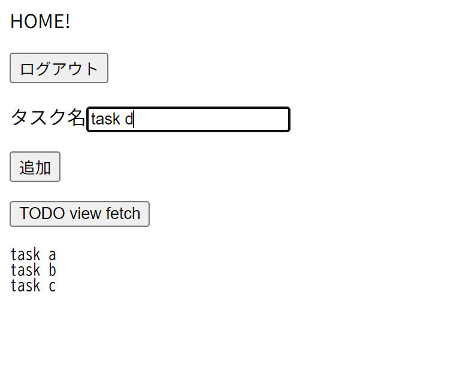

<div align="center">

# flask_TODO

TODOアプリ(?)。       
勉強用に作成。   

    

<br>
<br>
</div>

## パス説明
- / - サービス紹介画面
- /home - ユーザーホーム画面。TODOの一覧、追加の操作ができるHTMLが返される。ログイン必須
- /register - ユーザー登録画面。ユーザー登録ができる。emailは一意である必要がある。ユーザー作成に成功すると、/homeへリダイレクトされる。ユーザー作成に失敗した場合、リダイレクトされない
- /login - ユーザーログイン画面。ユーザーログインができる。ログインに成功すると、/homeへリダイレクトされる。ログインに失敗した場合、リダイレクトされない
- /api/register - ユーザー登録を受け付けるapi。POSTで登録する
- /api/login - ユーザーログインを受け付けるapi。POSTでログインする
- /api/logout - ユーザーログアウトを受け付けるapi。POSTでログアウトする。ログイン必須
- /api/todo - TODOの取得、追加を受け付けるapi。ログイン必須
  - GETでそのユーザーのTODOをすべてjsonで返す
  - POSTでTODOを追加する

## 使い方
```bash
pip install -r requirements.txt
```

```bash
python main.py
```
